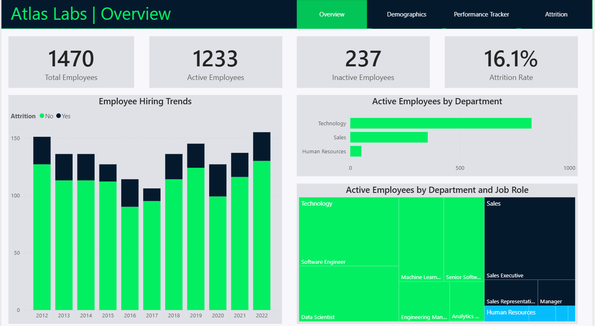
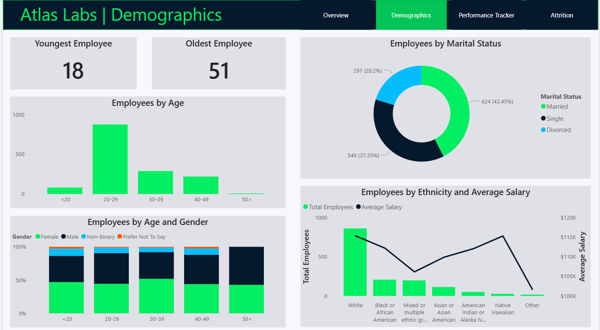
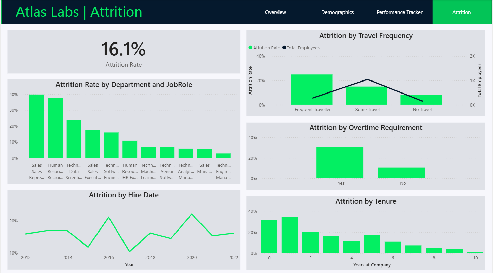

# HR Data Analytics

## Introduction

This repository contains a comprehensive **Human Resources Business Intelligence (BI) dashboard** developed in Power BI. The project analyzes employee data for Atlas Labs, a fictional organization, to uncover the underlying drivers of employee turnover and performance. By synthesizing complex datasets into actionable visualizations, this dashboard empowers HR leadership to transition from reactive hiring to proactive talent retention.

## Methodologies Implemented

In the development of the Atlas Labs HR Analytics Dashboard, a structured Business Intelligence (BI) methodology was employed to transform raw HR data into strategic insights. The process followed a standard data lifecycle, ensuring accuracy, scalability, and user-centric design.

### Data Requirements & Discovery
The first phase involved identifying the core business problems: high turnover and declining employee engagement.

 - **Defining KPIs:** Metrics such as Attrition Rate, Headcount, and Satisfaction Scores were selected as the primary success indicators.

 - **Data Sourcing:** The methodology integrated diverse data points including demographic profiles, performance reviews, and operational variables (overtime, travel frequency).

### Data Modeling & ETL (Extract, Transform, Load)
A robust data architecture was built within Power BI to ensure the dashboard remained performant and accurate.

 - **Star Schema Design:** The data was organized into a Star Schema, separating "Fact" tables (e.g., Attrition events, Performance ratings) from "Dimension" tables (e.g., Employee details, Date table). This optimizes filter performance across multiple visuals.

 - **DAX Calculations:** Advanced Data Analysis Expressions (DAX) were implemented to create dynamic measures, such as:

    - Moving Attrition Rates to smooth out monthly volatility.

    - Year-over-Year (YoY) Growth in headcount.

    - Satisfaction Indices that aggregate multiple survey responses into a single score.

### Exploratory Data Analysis (EDA)
Before finalizing visuals, a statistical analysis was performed to find hidden correlations.

 - **Correlation Analysis:** Methodologies were used to determine the relationship between "Overtime" and "Attrition," revealing a significant 20% gap in retention between the two groups.

 - **Cohort Analysis:** Employees were grouped by tenure "bins" (0-2 years, 3-5 years, etc.) to identify the "Critical Turnover Zone" within the first 24 months of employment.

### User-Centric Visual Design
The dashboard follows the Gestalt Principles of Visual Perception to guide the viewer’s eye toward high-priority information:

 - **Visual Hierarchy:** The most critical KPIs (Big Bold Numbers) are placed at the top left, following the "F-pattern" of human reading.

 - **Color Theory:** A high-contrast theme (Neon Green on Dark Blue) was utilized to highlight "Active" vs. "Inactive" status, making anomalies immediately scannable.

 - **Interactivity:** Implemented "Drill-through" and "Slicing" capabilities, allowing stakeholders to move from a global company view down to an individual employee’s performance history.

### Insight-to-Action Framework
The final methodology involved translating data into business strategy. This was achieved by categorizing findings into:

 - **Descriptive Analytics:** What happened? (e.g., "Attrition is at 16.1%").

 - **Diagnostic Analytics:** Why did it happen? (e.g., "Frequent travel is driving 25% of exits").

 - **Prescriptive Analytics:** What should we do? (e.g., "Implement mentorship for Year-1 employees").

## Dashboard Overview

### Executive Overview

The **Overview** page acts as the mission control for Atlas Labs' leadership. It provides a high-level summary of the organization's scale, tracking **1,470 total employees** and identifying the current **16.1% attrition rate** as a primary concern. By visualizing hiring trends from 2012 to 2022 alongside a breakdown of active staff by department, this page allows stakeholders to immediately see that the **Technology** department is the powerhouse of the company, while the **Sales** and **Human Resources** sectors require closer monitoring due to their smaller headcount relative to turnover volume.

### Demographic Insights

The **Demographics** page shifts the focus toward the "Who" behind the data. It reveals a relatively young workforce, with the largest concentration of employees falling into the **20–29 age bracket.** Key insights here include a deep dive into marital status and ethnicity, mapped against **average salary.** This page is essential for identifying potential diversity and inclusion gaps, showing, for instance, how salary benchmarks fluctuate across different ethnic groups and how the gender balance shifts as employees move into higher age categories (50+).

### Performance Tracker

The **Performance Tracker** is a diagnostic tool designed for individual-level management and "at-risk" detection. By selecting a specific employee—such as **Estelle Chung**—managers can view a multi-year longitudinal study of satisfaction across five key metrics: **Job, Relationship, Environment, Work-Life Balance, and Manager Ratings.** This page is a powerful predictive asset; a downward trend in these Satisfaction IDs over 24 months often serves as a "leading indicator" for an employee’s eventual exit, allowing for timely intervention before they become an attrition statistic.

### Attrition Deep-Dive

The **Attrition** page is the "Why" of the dashboard, isolating the variables that drive employees to leave. It highlights high-impact stressors, specifically showing that **Frequent Travel** and **Overtime Requirements** nearly double the likelihood of turnover. Perhaps the most actionable insight on this page is the **Tenure analysis,** which proves that the first two years of employment are the "danger zone" for Atlas Labs. This page provides the empirical evidence needed to overhaul onboarding processes and workload policies for high-risk roles like Sales Representatives.

## Key Metrics Analysis

 - **Headcount & Attrition:** Out of **1,470 total employees,** 237 are inactive, resulting in a **16.1% attrition rate.** This is a critical baseline for benchmarking against industry standards.

 - **Growth Trends:** Hiring peaked in 2012, 2019, and 2022. However, the "Attrition by Hire Date" chart shows a volatile trend, with a significant spike in attrition around **2016** and **2020.**

 - **Revenue Impact:** While specific dollar losses aren't listed, the high attrition in specialized roles (Sales Reps and HR) suggests significant costs in recruitment and lost productivity.

## Patterns & Trends

 - **The "Burnout" Correlation:** There is a stark correlation between Overtime and turnover. Employees requiring overtime have an attrition rate nearing **30%,** compared to roughly **10%** for those who don't.

 - **Travel Sensitivity:** High travel frequency is a primary driver of exit. "Frequent Travelers" exhibit an attrition rate of approximately **25%,** whereas "Non-Travelers" stay well below **10%.**

 - **The Tenure Danger Zone:** Attrition is highest in the first two years (peaking at **Year 1** at over 30%). If an employee stays past **Year 5,** the likelihood of them leaving drops significantly, hitting near-zero by **Year 10.**

## Segmentation Insights

 - **Role-Specific Vulnerability: Sales Representatives** and **HR Recruiters** are the highest-risk cohorts, both seeing attrition rates between **35%** and **40%.** In contrast, Managers and Engineering Managers show negligible turnover.

 - **Demographic Skew:** The workforce is heavily concentrated in the **20–29 age bracket.** This group traditionally seeks faster career progression, which aligns with the high turnover seen in the "1–2 years of tenure" segment.

 - **Marital Status:** Single employees represent a disproportionately large segment of the "Inactive" population compared to married or divorced counterparts.

## Anomalies & Risks

 - **The 2020 Spike:** A sharp increase in attrition occurred in 2020. Given the timeline, this may relate to pandemic-related shifts or a failure to adapt to remote work/safety needs.

 - **Performance Decay (Case Study):** The "Performance Tracker" for Estelle Chung shows a **downward trend in Manager Rating and Relationship Satisfaction** leading into 2022. This suggests that attrition is often preceded by a measurable 12–18 month decline in engagement metrics.

 - **Salary Inequity:** There is a visible dip in the average salary for **Mixed/Multiple ethnic groups** and **Other** categories compared to White or Native Hawaiian groups, which could pose an ESG (Environmental, Social, and Governance) risk.

## Business Insights

 - **Why it matters:** The company is losing its "top-of-funnel" talent. High turnover in junior roles (20-29 age group, <2 years tenure) creates a "leaky bucket" where Atlas Labs acts as a training ground for competitors rather than a long-term career destination.

 - **The Overtime Trap:** The business may be over-reliant on a small group of employees to handle surges, leading to the 30% attrition rate in the overtime segment.

## Recommendations

 - **Redesign the Sales Rep/Recruiter Path:** Given the 40% attrition rate, audit these roles for compensation competitiveness and workload balance. Implement a "stay bonus" or clear promotion milestones at the 18-month mark.

 - **Mitigate Travel & Overtime:** For "Frequent Travelers," implement a mandatory remote-work week or travel-free periods. Reduce overtime reliance by cross-training Technology staff to support Sales/HR during peak cycles.

 - **Enhanced Onboarding Mentorship:** Since Year 1 is the highest risk period, pair new hires with 5+ year veterans. Data shows that if an employee reaches Year 3, their retention probability doubles.

 - **Manager Intervention Protocol:** Use the "Performance Tracker" metrics to flag "at-risk" employees. A drop in "Relationship Satisfaction" or "Work-Life Balance" should trigger a skip-level meeting with HR.

## Questions for Further Analysis

 - **Exit Interview Data:** What are the qualitative reasons cited by the Sales Representatives leaving at a 40% rate?

 - **Remote Work Status:** How does the attrition rate differ between fully remote, hybrid, and on-site employees? (Missing data).

 - **Promotion Cycles:** Is there a correlation between the time since the last promotion and the 2020 attrition spike?

## Conclusion

The Atlas Labs HR Analytics Dashboard transforms fragmented workforce data into a unified strategic narrative, revealing that while the organization maintains a strong growth trajectory in its technology sector, it faces a significant retention challenge within the first two years of the employee lifecycle. By bridging the gap between high-level KPIs and granular performance metrics, the analysis identifies travel fatigue, overtime demands, and early-tenure engagement as the primary levers for organizational change. Ultimately, this business intelligence suite serves as more than just a reporting tool; it acts as a predictive roadmap that enables leadership to move beyond anecdotal observations toward a culture of data-driven empathy and targeted talent preservation. Successfully addressing the identified trends will not only reduce the costs associated with turnover but will also solidify Atlas Labs’ position as an employer of choice in a competitive market.